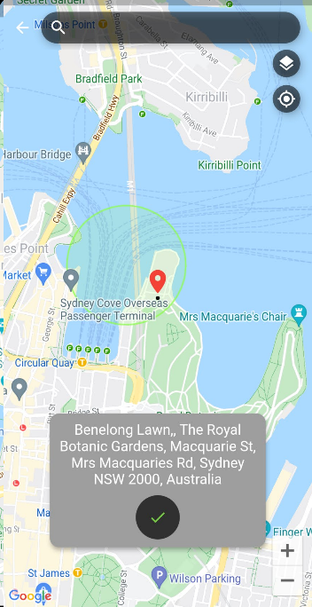

# Google Maps Place Picker

A Flutter plugin which provides 'Picking Place' using [Google Maps](https://developers.google.com/maps/) widget.

The project relies on below packages.

Map using Flutter's official [google_maps_flutter](https://pub.dev/packages/google_maps_flutter)   
Fetching current location using Baseflow's [geolocator](https://pub.dev/packages/geolocator)   
Place and Geocoding API using hadrienlejard's [google_maps_webservice](https://pub.dev/packages/google_maps_webservice)   
Builder using kevmoo's [tuple](https://pub.dev/packages/tuple)   

## Preview


## Support
If the package was useful or saved your time, please do not hesitate to buy me a cup of coffee! ;)  
The more caffeine I get, the more useful projects I can make in the future. 

<a href="https://www.buymeacoffee.com/Oj17EcZ" target="_blank"></a>

## Getting Started

* Get an API key at <https://cloud.google.com/maps-platform/>.

* Enable Google Map SDK for each platform.
  * Go to [Google Developers Console](https://console.cloud.google.com/).
  * Choose the project that you want to enable Google Maps on.
  * Select the navigation menu and then select "Google Maps".
  * Select "APIs" under the Google Maps menu.
  * To enable Google Maps for Android, select "Maps SDK for Android" in the "Additional APIs" section, then select "ENABLE".
  * To enable Google Maps for iOS, select "Maps SDK for iOS" in the "Additional APIs" section, then select "ENABLE".
  * Make sure the APIs you enabled are under the "Enabled APIs" section.

* You can also find detailed steps to get started with Google Maps Platform [here](https://developers.google.com/maps/gmp-get-started).

### Android

Specify your API key in the application manifest `android/app/src/main/AndroidManifest.xml`:

```xml
<manifest ...
  <application ...
    <meta-data android:name="com.google.android.geo.API_KEY"
               android:value="YOUR KEY HERE"/>
```

> **NOTE:** As of version 3.0.0 the geolocator plugin switched to the AndroidX version of the Android Support Libraries. This means you need to make sure your Android project is also upgraded to support AndroidX. Detailed instructions can be found [here](https://flutter.dev/docs/development/packages-and-plugins/androidx-compatibility). 
>
>The TL;DR version is:
>
>1. Add the following to your "gradle.properties" file:
>
>```
>android.useAndroidX=true
>android.enableJetifier=true
>```
>2. Make sure you set the `compileSdkVersion` in your "android/app/build.gradle" file to 28:
>
>```
>android {
>  compileSdkVersion 28
>
>  ...
>}
>```
>3. Make sure you replace all the `android.` dependencies to their AndroidX counterparts (a full list can be found here: https://developer.android.com/jetpack/androidx/migrate).

### iOS

Specify your API key in the application delegate `ios/Runner/AppDelegate.m`:

```objectivec
#include "AppDelegate.h"
#include "GeneratedPluginRegistrant.h"
#import "GoogleMaps/GoogleMaps.h"

@implementation AppDelegate

- (BOOL)application:(UIApplication *)application
    didFinishLaunchingWithOptions:(NSDictionary *)launchOptions {
  [GMSServices provideAPIKey:@"YOUR KEY HERE"];
  [GeneratedPluginRegistrant registerWithRegistry:self];
  return [super application:application didFinishLaunchingWithOptions:launchOptions];
}
@end
```

Or in your swift code, specify your API key in the application delegate `ios/Runner/AppDelegate.swift`:

```swift
import UIKit
import Flutter
import GoogleMaps

@UIApplicationMain
@objc class AppDelegate: FlutterAppDelegate {
  override func application(
    _ application: UIApplication,
    didFinishLaunchingWithOptions launchOptions: [UIApplicationLaunchOptionsKey: Any]?
  ) -> Bool {
    GMSServices.provideAPIKey("YOUR KEY HERE")
    GeneratedPluginRegistrant.register(with: self)
    return super.application(application, didFinishLaunchingWithOptions: launchOptions)
  }
}
```

On iOS you'll need to add the following entries to your Info.plist file (located under ios/Runner) in order to access the device's location. 

Simply open your Info.plist file and add the following:

``` xml
<key>NSLocationWhenInUseUsageDescription</key>
<string>This app needs access to location when open.</string>
<key>NSLocationAlwaysUsageDescription</key>
<string>This app needs access to location when in the background.</string>
<key>NSLocationAlwaysAndWhenInUseUsageDescription</key>
<string>This app needs access to location when open and in the background.</string>
```

In addition, you need to add the `Background Modes` capability to your XCode project (Project > Signing and Capabilties > "+ Capability" button) and select `Location Updates`.g>This app needs access to location when open and in the background.</string>

Opt-in to the embedded views preview by adding a boolean property to the app's `Info.plist` file
with the key `io.flutter.embedded_views_preview` and the value `YES`.

```xml
<key>io.flutter.embedded_views_preview</key>
<true/>
```
## Usage

### Basic usage

You can use PlacePicker by pushing to a new page using Navigator.
When the user picks a place on the map, it will return result to 'onPlacePicked' with PickResult type.
Alternatively, you can build your own way with 'selectedPlaceWidgetBuilder' and fetch result from it (See the instruction below).

```dart
Navigator.push(
      context,
      MaterialPageRoute(
        builder: (context) => PlacePicker(
          apiKey: APIKeys.apiKey,   // Put YOUR OWN KEY here.
          onPlacePicked: (result) { 
            print(result.address); 
            Navigator.of(context).pop();
          },
          initialPosition: HomePage.kInitialPosition,
          useCurrentLocation: true,
        ),
      ),
    );
```

#### PickResult 
Parameter | Type | Description
--------- | ---- | -----------
placeId | String | A textual identifier that uniquely identifies a place. To retrieve information about the place, pass this identifier in the placeId field of a Places API request. See [PlaceId](https://developers.google.com/places/web-service/place-id) for more information.
geometry | Geometry | Contains geometry information about the result, generally including the location (geocode) of the place and (optionally) the viewport identifying its general area of coverage.
formattedAddress | String | A string containing the human-readable address of this place. Often this address is equivalent to the "postal address".
types | List\<String\> | Contains an array of feature types describing the given result. See the [list of supported types](https://developers.google.com/places/web-service/supported_types#table2). XML responses include multiple <type> elements if more than one type is assigned to the result.
addressComponents | List\<AddressComponent\> | An array containing the separate components applicable to this address.
  
** Below results will be fetched only when using auto-complete search or usePlaceDetailSearch is set to true when searching by dragging the map.
#### PickResult (Optional)
Parameter | Type | Description
--------- | ---- | -----------
adrAddress | String | A representation of the place's address in the [adr microformat](http://microformats.org/wiki/adr)
formattedPhoneNumber | String | Contains the place's phone number in its [local format](http://en.wikipedia.org/wiki/Local_conventions_for_writing_telephone_numbers)
id | String | ? (Not documented at Google - see more info below)
reference | String | ? (Not documented at Google - see more info below)
icon | String | The URL of a suggested icon which may be displayed to the user when indicating this result on a map.
name | String | Human-readable name for the returned result
openingHours | OpeningHoursDetail | Opening hour information
photos | List\<Photo\> | Array of photo objects, each containing a reference to an image
internationalPhoneNumber | String | The place's phone number in international format
priceLevel | PriceLevel | The price level of the place, on a scale of 0 to 4. The exact amount indicated by a specific value will vary from region to region.
rating | num | The place's rating, from 1.0 to 5.0, based on aggregated user reviews.
scope | String |
url | String | The URL of the official Google page for this place. 
vicinity | String | Lists a simplified address for the place, including the street name, street number, and locality, but not the province/state, postal code, or country
utcOffset | num | The number of minutes this place’s current timezone is offset from UTC
website | String | The authoritative website for this place
reviews | List\<Review\> | JSON array of up to five reviews

[More info](https://developers.google.com/places/web-service/details) about results at Google document.

#### PlacePicker
Parameter | Type | Description
--------- | ---- | -----------
apiKey | String | (Required) Your google map API Key
onPlacePicked | Callback(PickResult) | Invoked when user picks the place and selects to use it. **This will not be called if you manually build 'selectedPlaceWidgetBuilder' as you will override default 'Select here' button.**
initialPosition | LatLng | (Required) Initial center position of google map when it is created. If useCurrentLocation is set to true, it will try to get device's current location first using GeoLocator. 
useCurrentLocation | bool | Whether to use device's current location for initial center position. This will be used instead of initial position when it is set to true AND user ALLOW to collect their location. If DENIED, initialPosition will be used.
desiredLocationAccuracy | [LocationAccuracy](https://pub.dev/packages/geolocator) | Accuracy of fetching current location. Defaults to 'high'.
hintText | String | Hint text of search bar
searchingText | String | A text which appears when searching is performing. Default to 'Searching...'
proxyBaseUrl | String | Used for API calling on google maps. In case of using a proxy the baseUrl can be set. The apiKey is not required in case the proxy sets it.
httpClient | [Client](https://pub.dev/packages/google_maps_webservice) | Used for API calling on google maps. In case of using a proxy url that requires authentication or custom configuration.
autoCompleteDebounceInMilliseconds | int | Debounce timer for auto complete input. Default to 500
cameraMoveDebounceInMilliseconds | int | Debounce timer for searching place with camera(map) dragging. Defaults to 750
intialMapType | MapType | MapTypes of google map. Defaults to normal.
enableMapTypeButton | bool | Whether to display MapType change button on the map
enableMyLocationButton | bool | Whether to display my location button on the map
usePinPointingSearch | bool | Defaults to true. This will allow user to drag map and get a place info where the pin is pointing.
usePlaceDetailSearch | bool | Defaults to false. Setting this to true will get detailed result from searching by dragging the map, but will use +1 request on Place Detail API.
onAutoCompleteFailed | Callback(String) | Invoked when auto complete search is failed
onGeocodingSearchFailed | Callback(String) | Invoked when searching place by dragging the map failed
onMapCreated | MapCreatedCallback | Returens google map controller when created
selectedPlaceWidgetBuilder | WidgetBuilder | Specified on below section
pinBuilder | WidgetBuilder | Specified on below section
autocompleteOffset | num | The position, in the input term, of the last character that the service uses to match predictions
autocompleteRadius | num | The distance (in meters) within which to return place results
autocompleteLanguage | String | The [language code](https://developers.google.com/maps/faq#languagesupport), indicating in which language the results should be returned, if possible. 
autocompleteComponents | List\<Components\> | A grouping of places to which you would like to restrict your results. Currently, you can use components to filter by up to 5 countries.
autocompleteTypes | List\<String\> | The types of place results to return. See [Place Types](https://developers.google.com/places/web-service/autocomplete#place_types).
strictbounds | bool | Returns only those places that are strictly within the region defined by location and radius.
region | String | region — The region code, specified as a ccTLD (country code top-level domain) two-character value. Most ccTLD codes are identical to ISO 3166-1 codes, with some exceptions. This parameter will only influence, not fully restrict, search results. If more relevant results exist outside of the specified region, they may be included. **When this parameter is used, the country name is omitted from the resulting formatted_address for results in the specified region.**
selectInitialPosition | bool | Whether to display selected place on initial map load. Defaults to false.
resizeToAvoidBottomInset | bool | Refer to Scaffold's resizeToAvoidBottomInset property.
initialSearchString | String | Sets initial search string for auto complete search
searchForInitialValue | bool | Wether to automatically search for initial value on start
forceAndroidLocationManager | bool | On Android devices you can set this to true to force the geolocator plugin to use the 'LocationManager' to determine the position instead of the 'FusedLocationProviderClient'. On iOS this is ignored.
myLocationButtonCooldown | int | Cooldown time in seconds for the 'myLocationButton'. Defaults to 10 seconds. 
forceSearchOnZoomChanged | bool | Wether to allow place search even when the zoom has changed. Defaults to false.
automaticallyImplyAppBarLeading | bool | By default, there is a back button on the top. Setting false will remove the back button.

[More info](https://developers.google.com/places/web-service/autocomplete) about autocomplete search at Google document.

### Customizing picked place visualisation

By default, when a user picks a place by using auto complete search or dragging the map, we display the information at the bottom of the screen (FloatingCard).  

However, if you don't like this UI/UX, simply override the builder using 'selectedPlaceWidgetBuilder'. FlocatingCard widget can be reused which is floating around the screen or build an entirely new widget as you want. It is stacked with the map, so you might want to use the [Positioned](https://api.flutter.dev/flutter/widgets/Positioned-class.html) widget.

**Note that using this customization WILL NOT INVOKE [onPlacePicked] callback as it will override default 'Select here' button on floating card**

```dart
...
PlacePicker(apiKey: APIKeys.apiKey,
            ...
            selectedPlaceWidgetBuilder: (_, selectedPlace, state, isSearchBarFocused) {
              return isSearchBarFocused
                  ? Container()
                  // Use FloatingCard or just create your own Widget.
                  : FloatingCard(
                      bottomPosition: 0.0,    // MediaQuery.of(context) will cause rebuild. See MediaQuery document for the information.
                      leftPosition: 0.0,
                      rightPosition: 0.0,
                      width: 500,
                      borderRadius: BorderRadius.circular(12.0),
                      child: state == SearchingState.Searching ? 
                                      Center(child: CircularProgressIndicator()) : 
                                      RaisedButton(onPressed: () { print("do something with [selectedPlace] data"); },),
                   );
            },
            ...
          ),
...
```
Parameters | Type | Description
---------- | ---- | -----------
context | BuildContext | Flutter's build context value
selectedPlace | PickResult | Result data of user selected place
state | SearchingState | State of searching action. (Idle, Searching)
isSearchBarFocused | bool | Whether the search bar is currently focused so the keyboard is shown

### Customizing Pin
By default, Pin icon is provided with very simple picking animation when moving around.   
However, you can also create your own pin widget using 'pinBuilder'

```dart
PlacePicker(apiKey: APIKeys.apiKey,
            ...
            pinBuilder: (context, state) {
                  if (state == PinState.Idle) {
                    return Icon(Icons.favorite_border);
                  } else {
                    return AnimatedIcon(.....);
                  }
                },
            ...                        
          ),
...
```

Parameters | Type | Description
---------- | ---- | -----------
context | BuildContext | Flutter's build context value
state | PinState | State of pin. (Preparing; When map loading, Idle, Dragging)

### Changing Colours of default FloatingCard
While you can build your own prediction tile, you still can change the style of default tile using themeData as below:

```dart
// Light Theme
final ThemeData lightTheme = ThemeData.light().copyWith(
  // Background color of the FloatingCard
  cardColor: Colors.white,
  buttonTheme: ButtonThemeData(
    // Select here's button color
    buttonColor: Colors.black,
    textTheme: ButtonTextTheme.primary,
  ),
);

// Dark Theme
final ThemeData darkTheme = ThemeData.dark().copyWith(
  // Background color of the FloatingCard
  cardColor: Colors.grey,
  buttonTheme: ButtonThemeData(
    // Select here's button color
    buttonColor: Colors.yellow,
    textTheme: ButtonTextTheme.primary,
  ),
);
```



## Feature Requests and Issues
Please file feature requests and bugs at the [issue tracker][tracker].

[tracker]: https://github.com/fysoul17/google_maps_place_picker/issues/new

### Other useful packages you might be insterested
[Firebase Auth Simplify](https://pub.dev/packages/firebase_auth_simplify)   
[Material design Speed Dial](https://pub.dev/packages/flutter_speed_dial_material_design) 

<a href="https://www.buymeacoffee.com/Oj17EcZ" target="_blank"></a>
